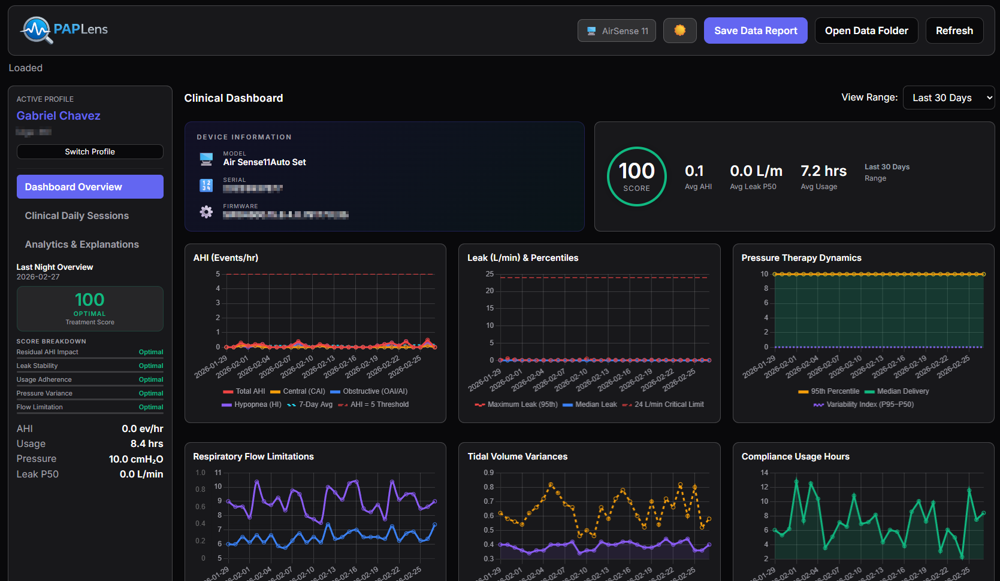
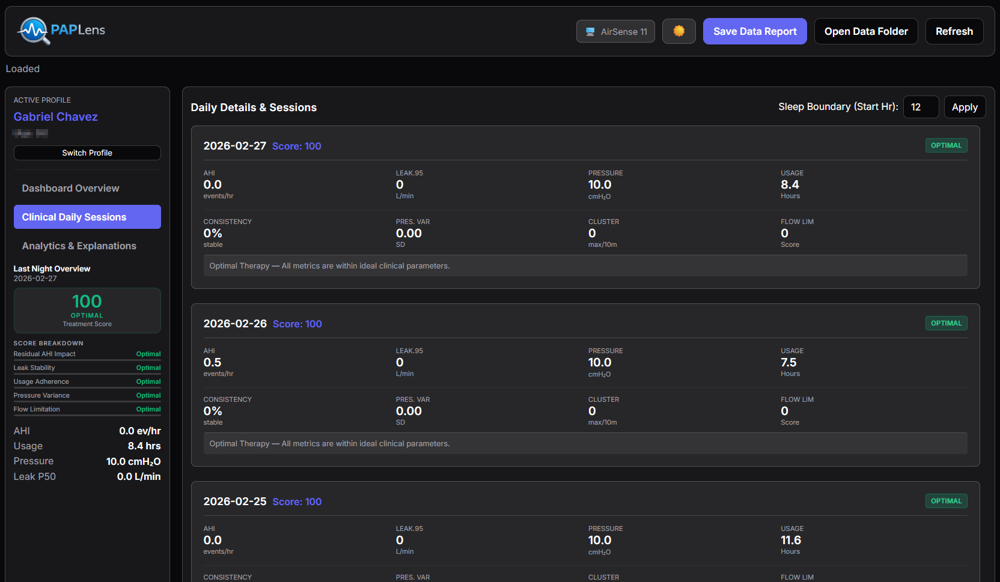
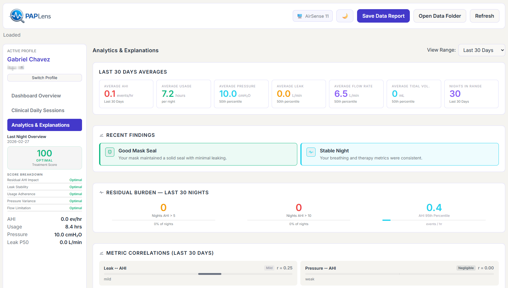
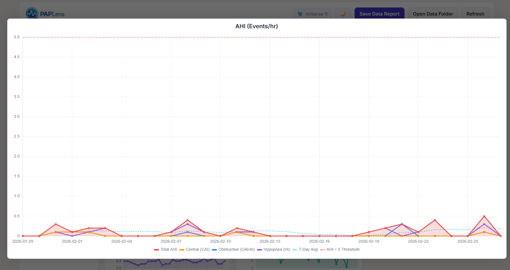
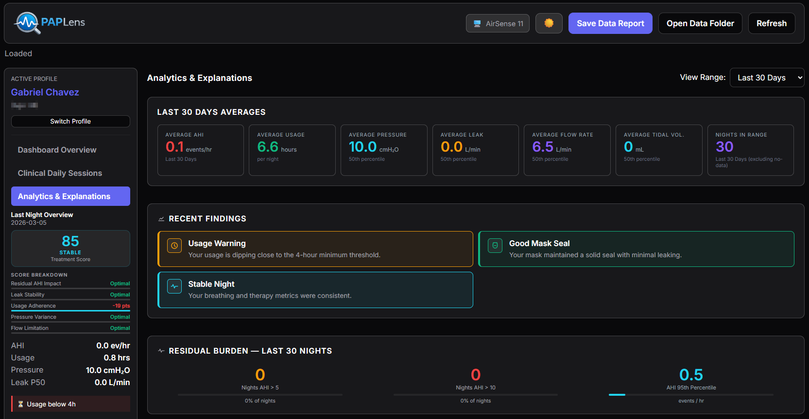
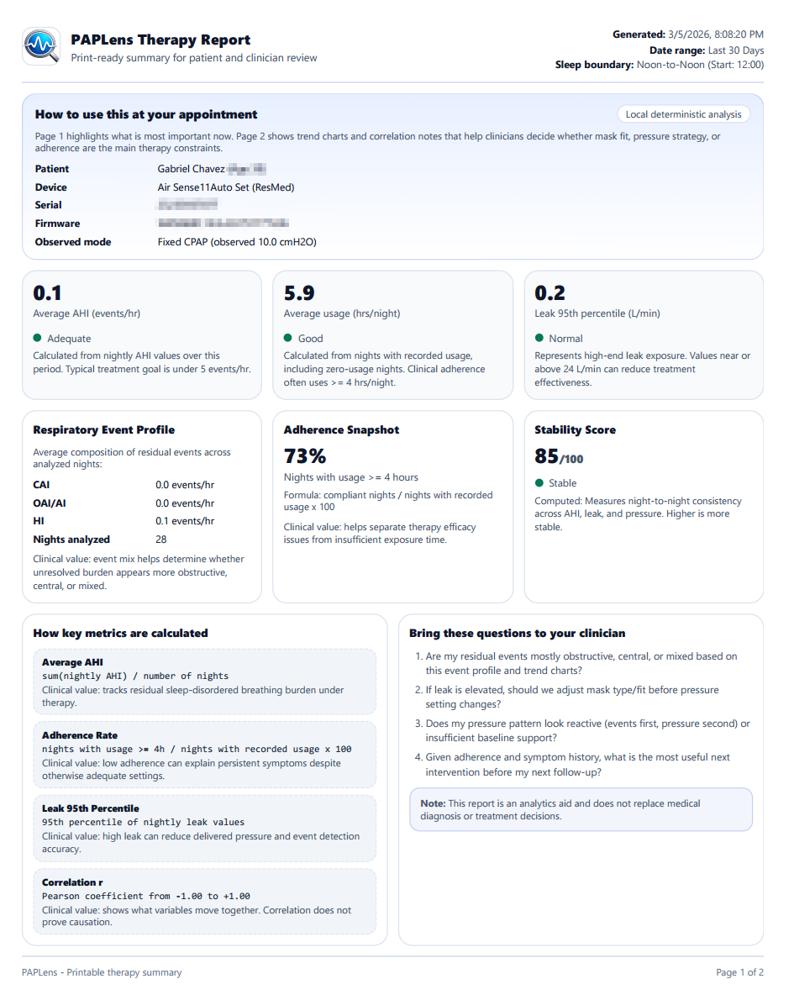
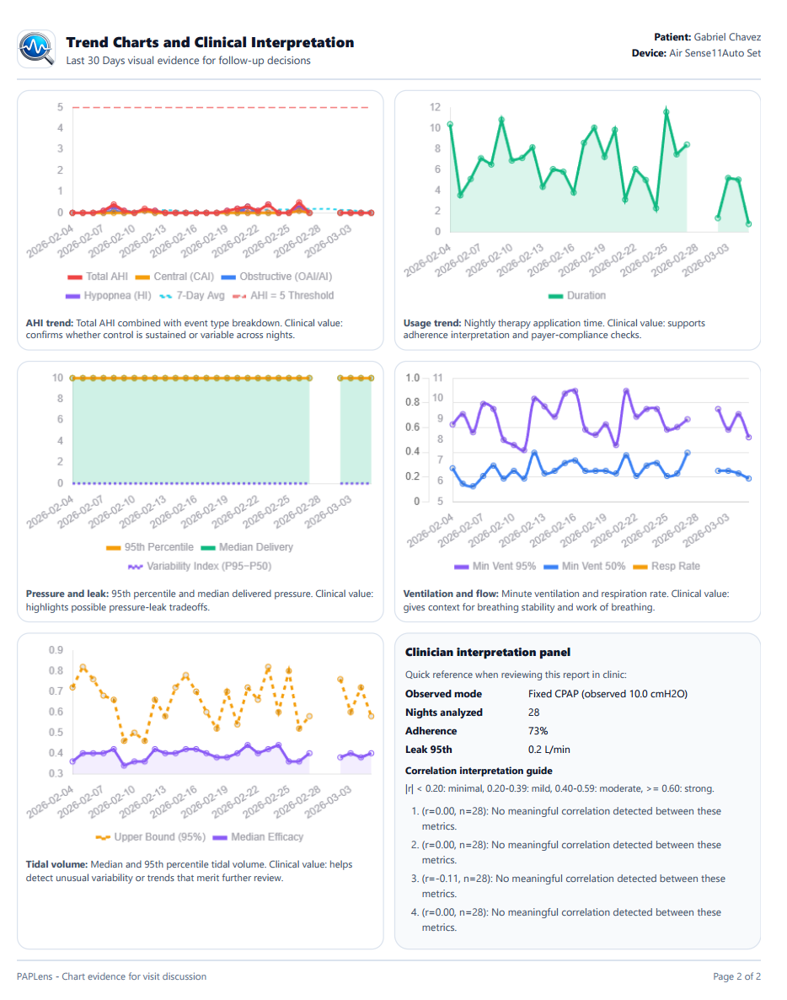

# PAPLens (v1.0.0)

<p align="center">
  
</p>

Desktop PAP/CPAP analytics for ResMed AirSense data, running fully offline.

Repository: https://github.com/GChavez0210/PAPLens

## Changelog

See [CHANGELOG.md](CHANGELOG.md) for the latest updates and release history.

## What PAPLens does

- Imports ResMed SD-card data incrementally into a local SQLite profile database.
- Supports multiple isolated user profiles.
- Detects device model/metadata from identification files.
- Provides dashboard + clinical daily session views + analytics/insights.
- Generates print-ready PDF reports intended for patient-to-clinician review.
- Exports a Windows installer for both `x64` and `arm64`.

## Screenshots









## Core analytics included

- AHI trends and event-type breakdown.
- Usage/adherence tracking (including >= 4h adherence rate).
- Leak analysis including high-percentile leak context.
- Pressure, ventilation/flow, and tidal trends.
- Residual burden indicators (nights AHI > 5, > 10, AHI p95).
- Correlation analysis with plain-language interpretation.
- Stability and mask-fit scoring (when score inputs are present).

## Data requirements

Import a folder copied from a compatible ResMed SD card, including relevant files such as:

- `STR.edf`
- `DATALOG/`
- `Identification.tgt` or `Identification.json`

## Runtime requirements (for users)

- Windows 10/11
- `x64` or `arm64`
- No cloud services required (local/offline use)

## Development requirements (for contributors/builders)

- Node.js 22+
- npm 10+
- Python 3.12+ (for native module rebuild via `node-gyp`)
- Visual Studio 2022 Build Tools with C++ workload

## Install and run locally (development)

```bash
git clone https://github.com/GChavez0210/PAPLens.git
cd PAPLens
npm install
npm run dev
```

Notes:

- Dev server uses `5173` with strict port mode.
- If Electron fails with `app.whenReady` undefined, clear `ELECTRON_RUN_AS_NODE` in your shell:

```powershell
$env:ELECTRON_RUN_AS_NODE=$null
npm run dev
```

## Build commands

```bash
npm run build
npm run dist
npm run dist:x64
npm run dist:arm64
```

Outputs are written to `release/`.

## Installer output

Primary installer (multi-arch NSIS):

- `release/PAPLens Setup 1.0.0.exe`

Unpacked folders are also produced for direct binary testing:

- `release/win-unpacked`
- `release/win-arm64-unpacked`

## PDF report generation

PDF reports are generated in Electron main process using Handlebars + `report.html`, then rendered to PDF via `printToPDF`.

## Attribution

PAPLens uses and builds upon the parsing approach from:

- **CPAP Data Viewer** by Paul Solares: https://github.com/xpaulso/cpap-viewer

## Built with AI

This application was built using an AI-assisted development workflow powered by **[Antigravity](https://antigravity.google/)**, **[Claude Code](https://claude.ai)** and **[Codex](https://chatgpt.com/codex)**. AI accelerated the creation of the codebase, enabling faster iteration cycles and a consistent architecture across the project.

All system design, validation, and testing remain under developer control. The application runs locally and deterministically, with no external AI services involved during normal operation, ensuring reliability and data privacy.

PAPLens is an analytics/support tool and does not replace clinical diagnosis or medical decision-making.

## License

MIT. See [LICENSE](LICENSE).
