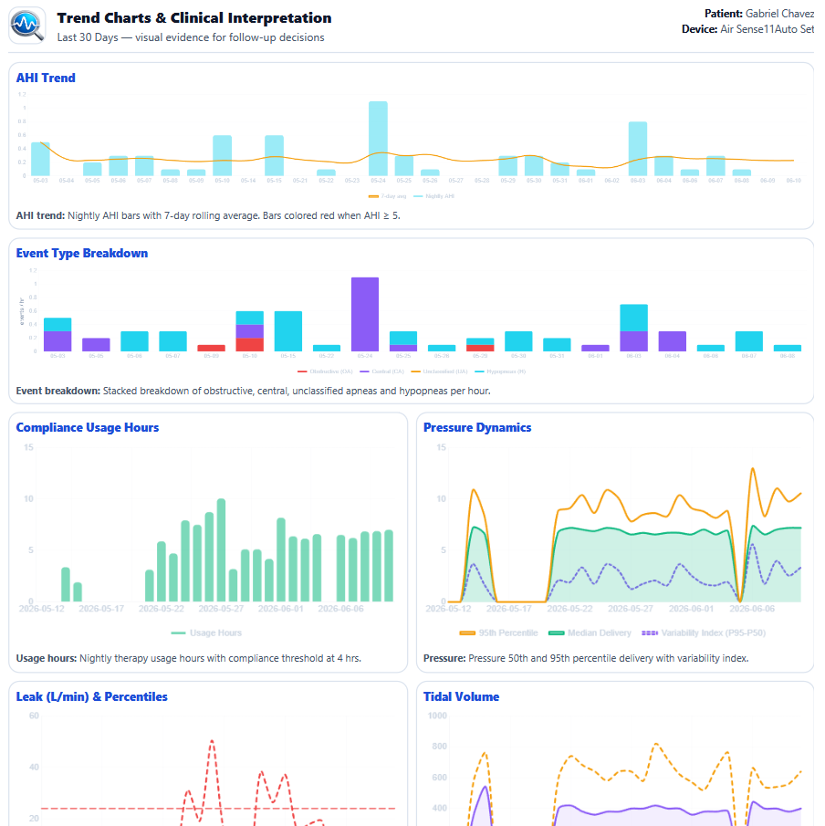
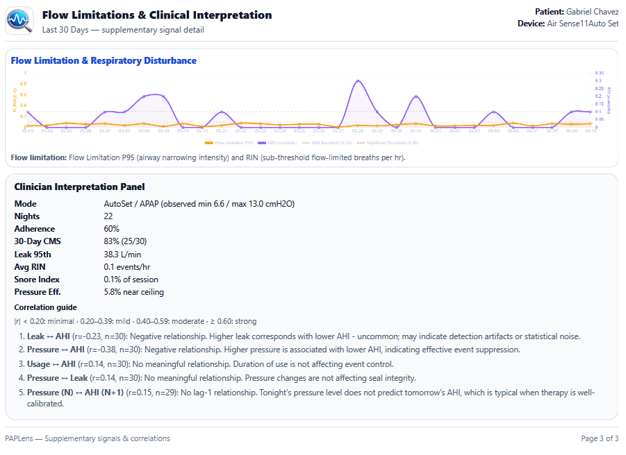

# PAPLens (v2.1.0)

  

  
  
  
  
  
  

  <strong>Desktop PAP/CPAP analytics for supported SD-card data, running fully offline.</strong>

  Import • Analyze • Visualize • Report

---

## Download

**Recommended:** Download the latest installer from the [Releases page](https://github.com/GChavez0210/PAPLens/releases).

Official releases are tested builds intended for daily use.

If you prefer to build from source or want access to unreleased changes, see [Building PAPLens](docs/BUILDING.md).

## Changelog

See [CHANGELOG.md](CHANGELOG.md) for the complete release history.

## Overview

PAPLens is a desktop application for importing, analyzing, and reporting PAP/CPAP therapy data from supported SD cards.

All analysis is performed locally on the user's machine. No therapy data is uploaded, transmitted, or shared with external services.

Designed for PAP/CPAP users who want deeper visibility into their therapy, PAPLens provides detailed analytics, long-term trend monitoring, waveform exploration, compliance tracking, and clinician-friendly reporting.

### Features

- Fully offline operation
- Local SQLite profile databases
- Incremental imports
- Multi-profile support
- Automatic device detection
- Detailed therapy analytics
- Dashboard visualizations and trend tracking
- Calendar heatmaps and compliance reporting
- Clinical insight generation
- EDF waveform viewing for supported sessions
- High-quality PDF report generation

### Metrics Tracked

When available from supported devices and imported data:

- Apnea-Hypopnea Index (AHI)
- Event breakdowns
- Leak rates
- Pressure statistics
- Usage and compliance
- Flow limitation
- Ventilation metrics
- Periodic breathing
- Session trends and long-term analytics

### Documentation

- [Feature Reference](docs/FEATURES.md)
- [Supported Devices](docs/SUPPORTED_DEVICES.md)
- [Building PAPLens](docs/BUILDING.md)
- [Development Notes](docs/DEVELOPMENT.md)

## Screenshots

## Supported Devices

See [SUPPORTED_DEVICES.md](docs/SUPPORTED_DEVICES.md) for the current compatibility list and data requirements.

## Privacy

Privacy is a core design principle of PAPLens.

- No cloud services are required
- No therapy data is uploaded
- No user accounts are required
- No telemetry or analytics are collected
- All processing occurs locally on your computer

## Support PAPLens

PAPLens is an independent open-source project developed and maintained during personal time.

If PAPLens has helped you better understand your therapy, consider supporting continued development:

  

Your support helps fund ongoing development, testing, documentation, and new features.

## Attribution

PAPLens incorporates and builds upon work from the following open-source projects:

### CPAP Data Viewer

By Paul Solares

https://github.com/xpaulso/cpap-viewer

### OSCAR

By The OSCAR Team

https://gitlab.com/pholy/OSCAR-code/-/tree/master/oscar/SleepLib/loader_plugins

### cpap-parser

By open-cpap

https://gitlab.com/open-cpap/cpap-parser

Additional attribution and licensing information can be found in:

- [NOTICES.md](NOTICES.md)

## Acknowledgments

PAPLens was developed using an AI-assisted development workflow powered by **[Antigravity](https://antigravity.google/)**, **[Claude Code](https://claude.ai)** and **[Codex](https://chatgpt.com/codex)**.

Architecture, implementation decisions, validation, testing, and release management remain under direct developer control.

## Medical Disclaimer

PAPLens is an analytics and reporting tool.

It is not a medical device, does not provide medical advice, and is not intended to replace professional medical evaluation, diagnosis, or treatment.

Users should consult qualified healthcare professionals regarding any medical concerns or treatment decisions.

## License

Licensed under the GNU General Public License v3.0 only (GPL-3.0-only).

See:

- [LICENSE](LICENSE)
- [NOTICES.md](NOTICES.md)
