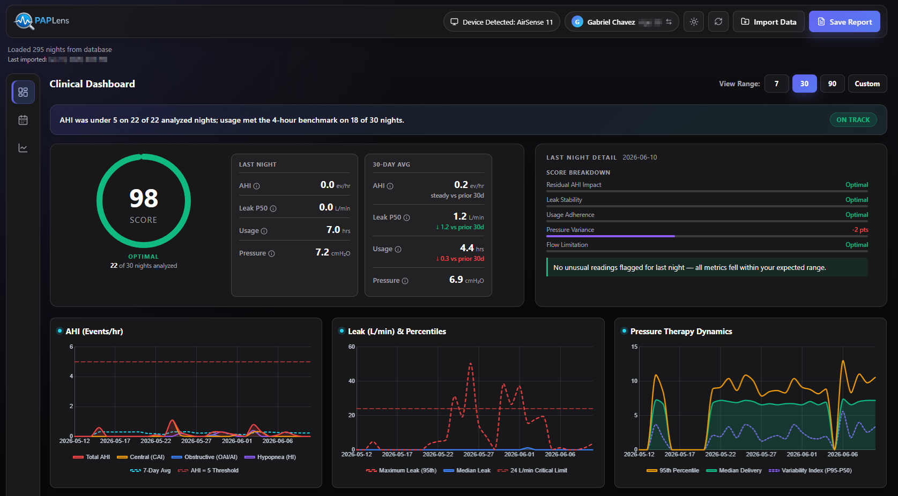
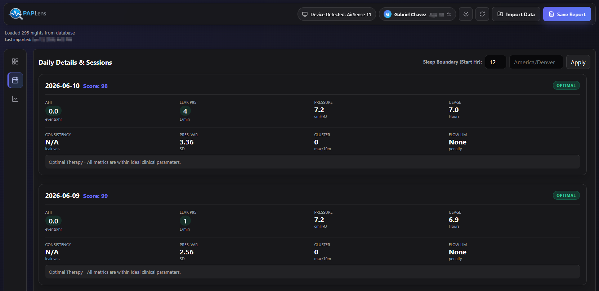
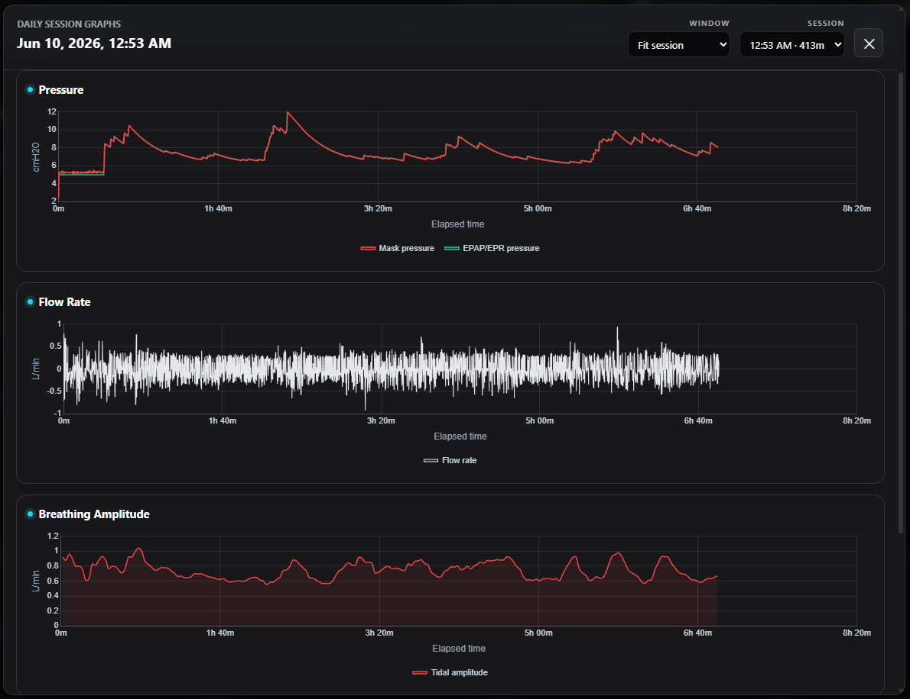
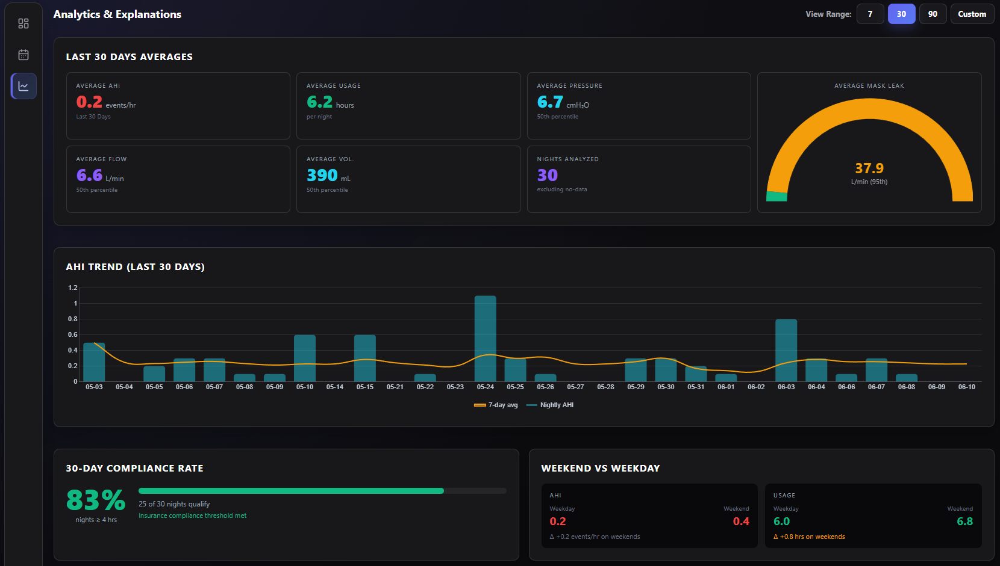
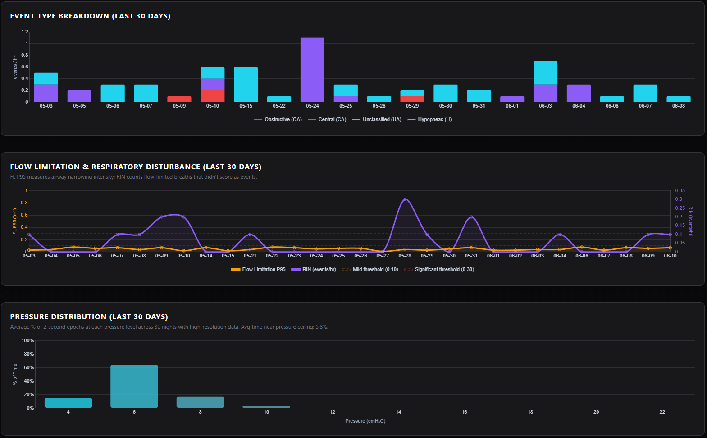
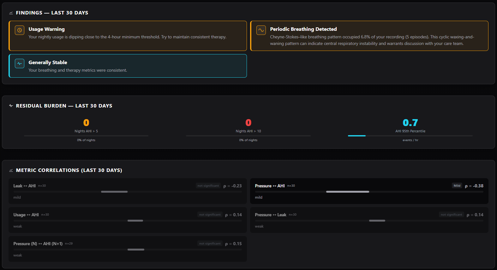
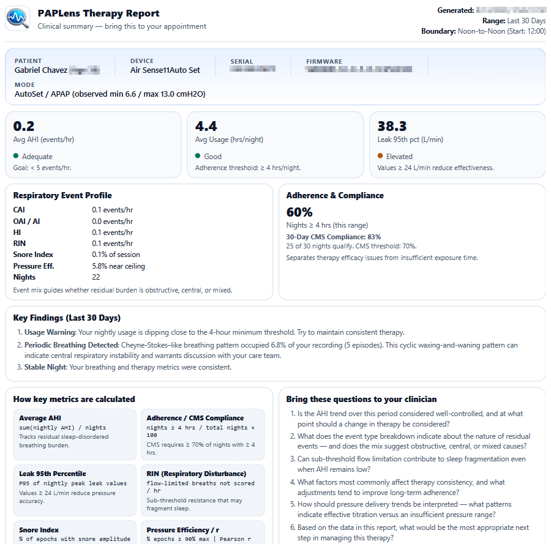

# PAPLens (v1.0.0)

<p align="center">
  
</p>

Desktop PAP/CPAP analytics for ResMed AirSense data, running fully offline.

Repository: https://github.com/GChavez0210/PAPLens

## Changelog

See [CHANGELOG.md](CHANGELOG.md) for the latest updates and release history.

## What PAPLens does

PAPLens is a fully offline desktop analytics tool for ResMed PAP therapy data. It reads your SD card, runs a clinical analytics pipeline locally, and gives you a dashboard and printable report designed to support conversations with your care team.

- Imports ResMed SD-card data (EDF format) incrementally into a local SQLite profile database — only new or changed nights are re-processed on subsequent imports.
- Supports multiple isolated patient profiles, each with their own database and last-used data path.
- Detects device model and metadata (AirSense 10 / AirSense 11) from identification files.
- Runs a full analytics pipeline on import: scoring, outlier detection, correlation analysis, and insight narrative generation — all local, no cloud.
- Provides a dashboard with trend charts, a sleep calendar heatmap, and a last-night summary sidebar.
- Provides an Insights page with metric trends, CMS compliance tracking, and Pearson correlation analysis.
- Generates print-ready two-page PDF reports intended for patient-to-clinician review.
- Exports a Windows installer for both `x64` and `arm64`.

## Screenshots









## Metrics tracked per night

| Metric | Description |
|--------|-------------|
| AHI | Total apnea-hypopnea index (events/hr) |
| CAI / OAI / UAI / HI | Event-type breakdown — central, obstructive, unclassified, hypopnea |
| Leak P50 / P95 | Median and 95th-percentile unintentional leak (L/min) |
| Pressure median / P95 | Delivered pressure distribution (cmH₂O) |
| Minute ventilation P50/P95 | Breathing volume per minute |
| Tidal volume P50/P95 | Volume per breath |
| Respiratory rate P50 | Breaths per minute |
| RIN | Respiratory Disturbance Index — sub-threshold flow-limited events per hour |
| Snore index | % of session epochs with snore amplitude above threshold |
| Pressure efficiency | % of epochs at or near the pressure ceiling |
| SpO₂ / Pulse | Oxygen saturation and heart rate when available from device |

## Dashboard

- **AHI trend chart** — nightly AHI over any selected time range
- **Usage trend** — hours per night with the 4-hour compliance threshold marked
- **Pressure & leak chart** — median pressure and P95 leak plotted together
- **Ventilation & flow chart** — minute ventilation and flow limitation trends
- **Tidal volume chart** — nightly tidal volume P50
- **Sleep calendar heatmap** — colour-coded calendar across all imported nights
- **Last night sidebar** — most recent session summary with sparklines for key metrics
- **Time range filter** — presets (7 / 14 / 30 / 90 / 180 days / all time) plus a custom date range picker
- **Sleep boundary hour** — adjustable start-of-day hour for shift workers or non-standard schedules
- **Dark / light theme** toggle

## Clinical analytics engine

All analytics run locally at import time. No data leaves the machine.

| Feature | Detail |
|---------|--------|
| **Therapy Stability Score** | 0–100 score measuring night-to-night consistency across AHI, leak, and pressure. Tiered: Optimal / Stable / Acceptable / Suboptimal / High Risk |
| **Leak severity classification** | Tiered leak assessment (None / Mild / Moderate / Severe) with a leak consistency index |
| **Compliance risk score** | Rolling 14-night usage assessment against the CMS 4-hour threshold |
| **Residual burden tracking** | 30-night AHI trend analysis flagging sustained elevated burden |
| **Outlier detection** | Z-score based flagging of nights with statistically abnormal values |
| **Metric correlations** | 30-night Pearson r analysis: Leak↔AHI, Pressure↔AHI, Usage↔AHI, Pressure↔Leak, and a lag-1 therapy response index (Pressure night N → AHI night N+1) |
| **Insight narratives** | Auto-generated plain-English clinical explanations for flagged nights |

## Insights page

- Full per-night metric table across the selected range
- Average summary (AHI, usage, pressure, leak, ventilation, tidal volume)
- CMS 30-day compliance panel — rolling compliant night count vs. the 70% threshold
- Metric correlations panel — strength label and plain-English interpretation for each correlation pair
- Clinical insight narratives from the analytics engine

## PDF report export

The **Save Data Report** button (hover for description) generates a print-ready Letter-format PDF.

**Page 1 — Clinical Summary**
- Patient and device info strip (name, age, model, serial, firmware, therapy mode)
- Key KPIs: average AHI, average usage, leak P95 — each with a status indicator (good / warn / bad)
- Respiratory event profile (CAI, OAI, HI, RIN, snore index, pressure efficiency, nights analyzed)
- Adherence & 30-day CMS compliance panel
- Therapy Stability Score with tier label
- Metric Correlations card (when data is available)
- Metric calculation reference — formulas and clinical rationale for each key metric
- Clinician question checklist — five guided questions to raise at the appointment

**Page 2 — Trend Charts & Interpretation**
- All five trend charts rendered as images
- Clinician interpretation panel with correlation guide and Pearson r values with plain-English notes

## Multi-profile support

- Create, switch, and delete profiles for different patients or device configurations
- Each profile has its own isolated SQLite database and remembers the last-used data path
- Active profile is persisted securely between sessions using OS-level credential storage (Electron `safeStorage` → Windows Credential Manager)

## Data requirements

Import a folder copied from a compatible ResMed SD card. The folder must contain:

- `STR.edf` — summary statistics (required)
- `DATALOG/` — per-session EDF signal files
- `Identification.tgt` or `Identification.json` — device metadata

Compatible devices: **ResMed AirSense 10** and **AirSense 11** series.

## Tech stack

| Layer | Technology |
|-------|------------|
| Shell | Electron 36 |
| UI | React 19 + Vite 7 |
| Charts | Chart.js 4 |
| Database | SQLite via better-sqlite3 |
| Report templating | Handlebars |
| Packaging | electron-builder — NSIS installer, x64 + arm64 |

## Runtime requirements (for users)

- Windows 10/11
- `x64` or `arm64`
- No cloud services required (local/offline use)

## Development requirements (for contributors/builders)

- Node.js 22+
- npm 10+
- Python 3.12+ (for native module rebuild via `node-gyp`)
- Visual Studio 2022 Build Tools with C++ workload

## Install and run locally (development)

```bash
git clone https://github.com/GChavez0210/PAPLens.git
cd PAPLens
npm install
npm run dev
```

Notes:

- Dev server uses `5173` with strict port mode.
- If Electron fails with `app.whenReady` undefined, clear `ELECTRON_RUN_AS_NODE` in your shell:

```powershell
$env:ELECTRON_RUN_AS_NODE=$null
npm run dev
```

## Build commands

```bash
npm run build
npm run dist
npm run dist:x64
npm run dist:arm64
```

Outputs are written to `release/`.

## Installer output

Primary installer (multi-arch NSIS):

- `release/PAPLens Setup 1.0.0.exe`

Unpacked folders are also produced for direct binary testing:

- `release/win-unpacked`
- `release/win-arm64-unpacked`

## PDF report generation

PDF reports are generated in Electron main process using Handlebars + `report.html`, then rendered to PDF via `printToPDF`.

## Attribution

PAPLens uses and builds upon the parsing approach from:

- **CPAP Data Viewer** by Paul Solares: https://github.com/xpaulso/cpap-viewer

## Built with AI

This application was built using an AI-assisted development workflow powered by **[Antigravity](https://antigravity.google/)**, **[Claude Code](https://claude.ai)** and **[Codex](https://chatgpt.com/codex)**. AI accelerated the creation of the codebase, enabling faster iteration cycles and a consistent architecture across the project.

All system design, validation, and testing remain under developer control. The application runs locally and deterministically, with no external AI services involved during normal operation, ensuring reliability and data privacy.

PAPLens is an analytics/support tool and does not replace clinical diagnosis or medical decision-making.

## License

MIT. See [LICENSE](LICENSE).
